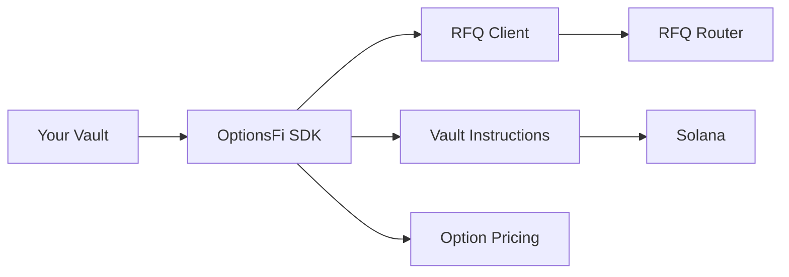

## Overview

This guide covers how to integrate the OptionsFi SDK with your vault strategy. Whether you're building a covered call vault, put-selling strategy, or custom structured product, the SDK provides all the tools you need.

## Architecture



## Integration Patterns

### Pattern 1: Keeper-Managed (Recommended)

Let the OptionsFi keeper handle the RFQ lifecycle:

```typescript
import { VaultInstructions, deriveVaultPda } from '@optionsfi/sdk';
import { Connection } from '@solana/web3.js';

class VaultManager {
  private vaultIx: VaultInstructions;
  private assetId: string;
  
  constructor(connection: Connection, assetId: string) {
    this.vaultIx = new VaultInstructions(connection);
    this.assetId = assetId;
  }
  
  async initialize() {
    await this.vaultIx.initialize();
  }
  
  async getVaultState() {
    return await this.vaultIx.fetchVault(this.assetId);
  }
  
  async canTrade(notional: bigint) {
    const vault = await this.getVaultState();
    if (!vault) return false;
    return VaultInstructions.canAcceptExposure(vault, notional);
  }
}
```

### Pattern 2: Self-Managed RFQs

Control the entire RFQ flow yourself:

```typescript
import { 
  RFQClient, 
  VaultInstructions, 
  OptionPricing,
  DEVNET_CONFIG,
  deriveVaultPda 
} from '@optionsfi/sdk';

class SelfManagedVault {
  private rfqClient: RFQClient;
  private vaultIx: VaultInstructions;
  private assetId: string;
  
  constructor(connection: Connection, assetId: string) {
    this.rfqClient = new RFQClient(DEVNET_CONFIG);
    this.vaultIx = new VaultInstructions(connection);
    this.assetId = assetId;
  }
  
  async initialize() {
    await this.rfqClient.connect();
    await this.vaultIx.initialize();
  }
  
  async runEpoch(spotPrice: number, volatility: number) {
    const vault = await this.vaultIx.fetchVault(this.assetId);
    if (!vault) throw new Error('Vault not found');
    
    // Calculate optimal parameters
    const strike = spotPrice * 1.05; // 5% OTM
    const expiry = this.getNextFridayExpiry();
    const quantity = VaultInstructions.getRemainingCapacity(vault);
    
    if (quantity <= 0n) {
      console.log('Vault at capacity');
      return null;
    }
    
    // Create RFQ
    const rfqId = await this.rfqClient.createRFQ({
      asset: this.assetId,
      side: 'sell',
      optionType: 'call',
      strike,
      expiry,
      quantity,
      vaultAddress: vault.authority.toString(),
    });
    
    // Collect quotes
    const quotes = await this.collectQuotes(rfqId, spotPrice, strike, expiry, volatility);
    
    if (quotes.length === 0) {
      await this.rfqClient.cancelRFQ(rfqId);
      return null;
    }
    
    // Execute best quote
    const best = quotes.reduce((a, b) => a.premium > b.premium ? a : b);
    return await this.rfqClient.executeOption(rfqId, best.id, this.wallet);
  }
  
  private getNextFridayExpiry(): number {
    const now = new Date();
    const friday = new Date();
    friday.setDate(now.getDate() + ((5 - now.getDay() + 7) % 7 || 7));
    friday.setUTCHours(21, 0, 0, 0); // 4pm ET
    return Math.floor(friday.getTime() / 1000);
  }
  
  private async collectQuotes(
    rfqId: string,
    spotPrice: number,
    strike: number,
    expiry: number,
    volatility: number
  ) {
    const validQuotes: Quote[] = [];
    
    // Calculate fair value
    const fairValue = OptionPricing.blackScholes({
      spot: spotPrice,
      strike,
      timeToExpiry: OptionPricing.timeToExpiry(expiry),
      riskFreeRate: 0.05,
      volatility,
    }).call;
    
    this.rfqClient.subscribeToQuotes(rfqId, (quote) => {
      const validation = OptionPricing.validateQuote(
        Number(quote.premium) / 1e6,
        fairValue,
        500
      );
      if (validation.isValid) {
        validQuotes.push(quote);
      }
    });
    
    // Wait for quotes
    await new Promise(r => setTimeout(r, 10000));
    
    return validQuotes;
  }
}
```

## Vault State Management

### Reading Vault State

```typescript
const vault = await vaultIx.fetchVault('NVDAX');

// Key metrics
const sharePrice = VaultInstructions.calculateSharePrice(vault);
const utilization = VaultInstructions.calculateUtilization(vault);
const capacity = VaultInstructions.getRemainingCapacity(vault);

console.log('Share Price:', sharePrice);
console.log('Utilization:', (utilization * 100).toFixed(2) + '%');
console.log('Remaining Capacity:', capacity.toString());
```

### Epoch Management

```typescript
async function advanceEpoch(
  vaultIx: VaultInstructions,
  assetId: string,
  premiumEarned: bigint,
  authority: Keypair
) {
  const [vaultPda] = deriveVaultPda(assetId);
  
  const ix = await vaultIx.advanceEpoch({
    vault: vaultPda,
    authority: authority.publicKey,
    premiumEarned,
  });
  
  const tx = new Transaction().add(ix);
  return await sendAndConfirmTransaction(connection, tx, [authority]);
}
```

## Premium Collection

After an RFQ is filled, collect premium from the market maker:

```typescript
async function collectPremium(
  vaultIx: VaultInstructions,
  assetId: string,
  premiumAmount: bigint,
  payerTokenAccount: PublicKey,
  authority: Keypair
) {
  const [vaultPda] = deriveVaultPda(assetId);
  
  const ix = await vaultIx.collectPremium({
    vault: vaultPda,
    authority: authority.publicKey,
    payerTokenAccount,
    amount: premiumAmount,
  });
  
  const tx = new Transaction().add(ix);
  return await sendAndConfirmTransaction(connection, tx, [authority]);
}
```

## Settlement Handling

Handle ITM option settlement at expiry:

```typescript
async function handleSettlement(
  vaultIx: VaultInstructions,
  assetId: string,
  spotAtExpiry: number,
  strike: number,
  notional: bigint,
  recipient: PublicKey,
  recipientTokenAccount: PublicKey,
  authority: Keypair
) {
  // Check if option is ITM
  const isITM = spotAtExpiry > strike; // For calls
  
  if (!isITM) {
    console.log('Option expired OTM, no settlement needed');
    return null;
  }
  
  // Calculate settlement amount
  const settlementPerUnit = spotAtExpiry - strike;
  const totalSettlement = BigInt(Math.floor(settlementPerUnit * Number(notional) / 1e6));
  
  const [vaultPda] = deriveVaultPda(assetId);
  
  const ix = await vaultIx.paySettlement({
    vault: vaultPda,
    authority: authority.publicKey,
    recipient,
    recipientTokenAccount,
    amount: totalSettlement,
  });
  
  const tx = new Transaction().add(ix);
  return await sendAndConfirmTransaction(connection, tx, [authority]);
}
```

## Risk Management

### Utilization Limits

```typescript
function checkUtilizationLimits(vault: VaultData): boolean {
  const utilization = VaultInstructions.calculateUtilization(vault);
  const maxUtilization = vault.utilizationCapBps / 10000; // Convert bps to decimal
  
  return utilization < maxUtilization;
}
```

### Delta Exposure

```typescript
function calculateDeltaExposure(
  vault: VaultData,
  spotPrice: number,
  strike: number,
  expiry: number,
  volatility: number
) {
  const tte = OptionPricing.timeToExpiry(expiry);
  const { delta } = OptionPricing.blackScholes({
    spot: spotPrice,
    strike,
    timeToExpiry: tte,
    riskFreeRate: 0.05,
    volatility,
  });
  
  const notionalExposed = Number(vault.epochNotionalExposed) / 1e6;
  const deltaExposure = delta.call * notionalExposed;
  
  return {
    delta: delta.call,
    notionalExposed,
    deltaExposure,
    dollarDelta: deltaExposure * spotPrice,
  };
}
```

## Event Monitoring

```typescript
class VaultMonitor {
  constructor(private rfqClient: RFQClient) {
    this.setupEventHandlers();
  }
  
  private setupEventHandlers() {
    this.rfqClient.onEvent((event) => {
      switch (event.type) {
        case 'quote_received':
          this.onQuote(event);
          break;
        case 'rfq_filled':
          this.onFill(event);
          break;
        case 'rfq_expired':
          this.onExpiry(event);
          break;
        case 'connection_error':
          this.onError(event);
          break;
      }
    });
  }
  
  private onQuote(event: RFQEvent) {
    console.log(`New quote for RFQ ${event.rfqId}`);
    // Send notification, update UI, etc.
  }
  
  private onFill(event: RFQEvent) {
    console.log(`RFQ ${event.rfqId} filled!`);
    // Record trade, update accounting, etc.
  }
  
  private onExpiry(event: RFQEvent) {
    console.log(`RFQ ${event.rfqId} expired`);
    // Log for analysis
  }
  
  private onError(event: RFQEvent) {
    console.error('Connection error:', event.data);
    // Trigger reconnection logic
  }
}
```

## Best Practices

<CardGroup cols={2}>
  <Card title="Validate Capacity" icon="gauge">
    Always check vault capacity before creating RFQs
  </Card>
  <Card title="Track All Trades" icon="database">
    Maintain comprehensive records of all RFQs and fills
  </Card>
  <Card title="Monitor Exposure" icon="eye">
    Track delta and notional exposure in real-time
  </Card>
  <Card title="Handle Failures" icon="refresh">
    Implement retry logic and fallback strategies
  </Card>
</CardGroup>
