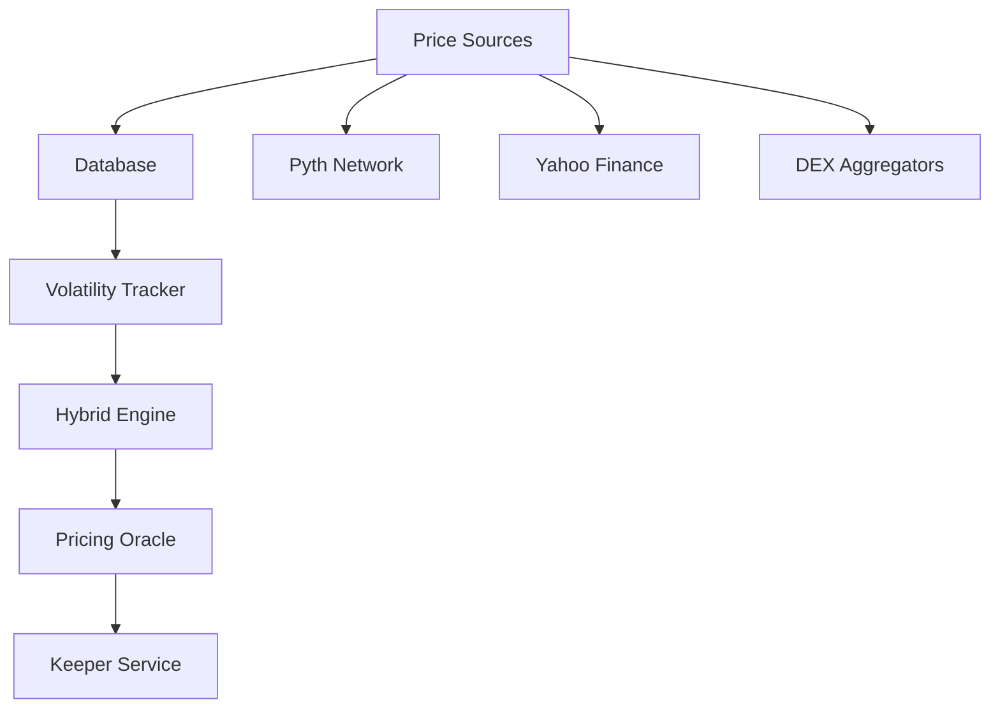

## What is the OptionsFi Oracle?

The OptionsFi Oracle is a hybrid pricing system that combines on-chain and traditional finance (TradFi) data to provide accurate, risk-adjusted option pricing for tokenized assets.

### The Problem

Tokenized assets trade 24/7 on-chain but their volatility can diverge significantly from their TradFi counterparts due to:

- **Continuous trading** - No market hours restrictions
- **Different liquidity** - On-chain liquidity may vary from traditional markets
- **Independent price discovery** - On-chain prices can lead or lag TradFi

Using only TradFi data (like Yahoo Finance) can lead to significant mispricing of options.

### The Solution

The hybrid oracle intelligently blends:

1. **On-Chain Volatility** - Calculated from historical on-chain price movements
2. **TradFi Volatility** - From traditional market data (Yahoo Finance)
3. **Confidence Weighting** - Based on data quality and availability
4. **Risk Adjustment** - Adds buffers when divergence is high

## Real-World Results

In testing with NVDAX (tokenized NVIDIA):

<CardGroup cols={2}>
  <Card title="On-Chain Volatility" icon="chart-line">
    39.65% annualized
  </Card>
  <Card title="TradFi Volatility" icon="building-columns">
    30.65% annualized
  </Card>
  <Card title="Divergence Detected" icon="triangle-exclamation">
    29.4% difference (WARNING)
  </Card>
  <Card title="Cost Savings" icon="dollar-sign">
    $280 per 1,000 contracts
  </Card>
</CardGroup>

## Key Features

<AccordionGroup>
  <Accordion title="Multi-Source Data Aggregation">
    Fetches prices from:
    - Pyth Network (on-chain)
    - Yahoo Finance (TradFi)
    - DEX aggregators (ready for integration)
  </Accordion>

  <Accordion title="Intelligent Blending">
    - Weights data by confidence score
    - Maximum 70% on-chain (always uses ≥30% TradFi)
    - Adjusts for 24/7 trading (+7.5% premium)
  </Accordion>

  <Accordion title="Risk-Adjusted Pricing">
    Adds safety buffers based on divergence:
    - Safe (< 10%): +3% buffer
    - Caution (10-25%): +8% buffer
    - Warning (> 25%): +15% buffer
  </Accordion>

  <Accordion title="Real-Time Monitoring">
    - Divergence alerts
    - Confidence scoring
    - Performance caching (5-15 min TTL)
  </Accordion>
</AccordionGroup>

## Architecture



## Quick Start

<Steps>
  <Step title="Install the package">
    ```bash
    npm install @optionsfi/oracle
    ```
  </Step>
  
  <Step title="Set up database">
    Run the Supabase schema to create necessary tables
  </Step>
  
  <Step title="Configure environment">
    ```bash
    SUPABASE_URL=your-project-url
    SUPABASE_KEY=your-anon-key
    SOLANA_RPC_URL=https://api.devnet.solana.com
    ```
  </Step>
  
  <Step title="Start using the oracle">
    See the [Integration Guide](/oracle/integration) for details
  </Step>
</Steps>

## Performance

<ResponseField name="Response Time" type="number">
  < 1 second total (including database queries and calculations)
</ResponseField>

<ResponseField name="Database Queries" type="number">
  < 50ms with proper indexing
</ResponseField>

<ResponseField name="Cache TTL" type="string">
  5-15 minutes for volatility calculations
</ResponseField>

## Cost

<Info>
  **Development**: Free (Supabase free tier)
  
  **Production**: $25/month (Supabase Pro recommended)
</Info>

## Next Steps

<CardGroup cols={2}>
  <Card title="Integration Guide" icon="plug" href="/oracle/integration">
    Learn how to integrate the oracle into your application
  </Card>
  <Card title="API Reference" icon="code" href="/oracle/api-reference">
    Complete API documentation
  </Card>
  <Card title="Pricing Math" icon="calculator" href="/oracle/pricing">
    Understand the volatility and pricing calculations
  </Card>
  <Card title="Best Practices" icon="star" href="/oracle/best-practices">
    Production deployment guidelines
  </Card>
</CardGroup>
